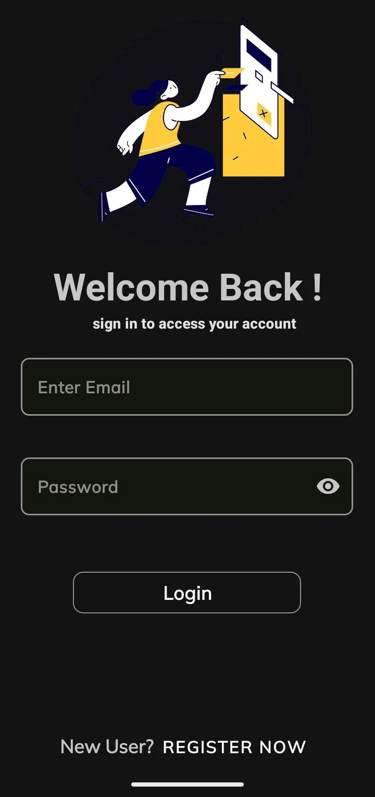
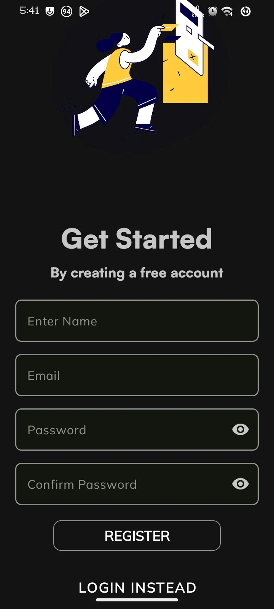
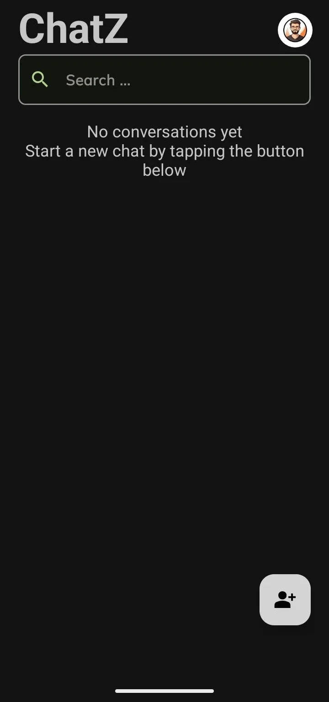
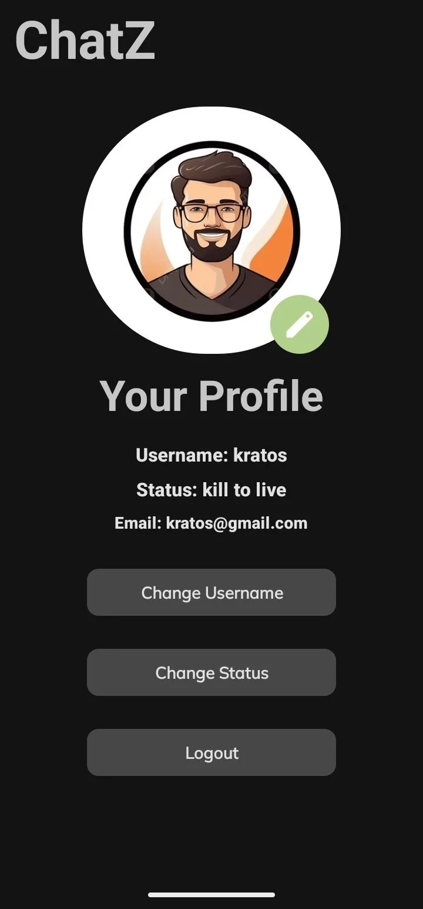
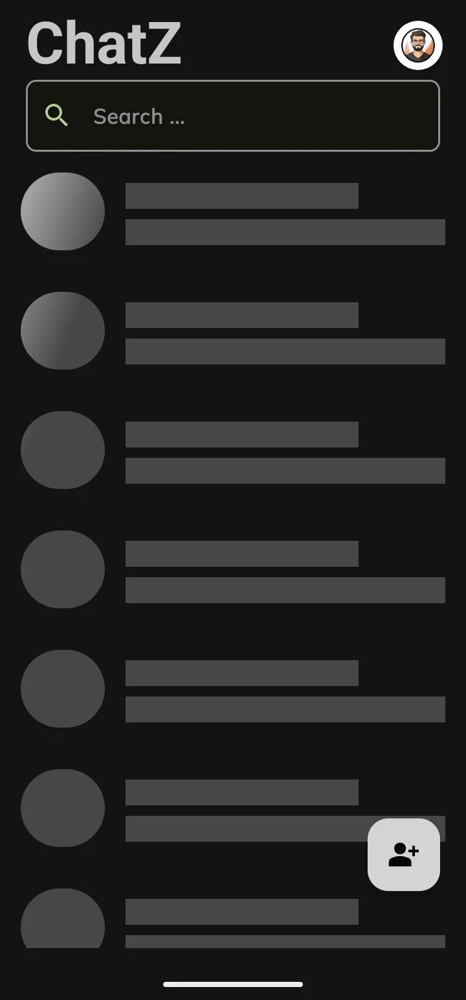
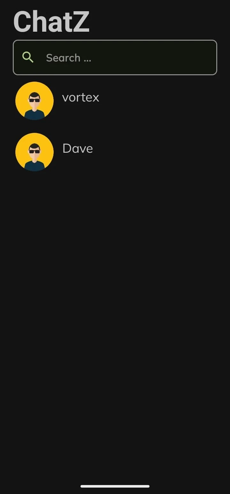
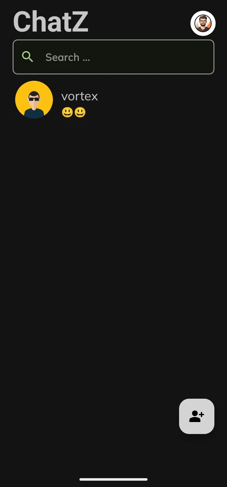

## Overview

💬 **ChatZ** is a sleek, real-time chat application for Android, built using **Kotlin** and traditional **XML layouts**. Powered by **Firebase**, ChatZ delivers smooth, reliable messaging with a modern, minimal design.

## Key Features

- **Real-Time Chat**  
  Instantly send and receive messages with Firebase Realtime Database.

- **User Authentication**  
  Sign in or sign up securely using Firebase Auth.

- **Clean UI**  
  XML-based layouts with Material Design 3 support.

- **Timestamps**  
  Messages show accurate time sent and received.

- **User Profiles**  
  View and update profile details.

- **Custom Edits to User Profile**  
  Show your profile status and username with personalized profile picture.

## 🛠️ Built With

- Kotlin – Primary development language  
- XML Layouts – Classic UI building approach  
- Firebase – Backend for Auth and Firestore DB
- Cloudinary - For Image hosting 
- ViewModel + LiveData – MVVM architecture  
- Glide – Image loading  
- Material3 – UI theming and styling  
- Navigation Component – For screen transitions

## 🧰 Tech Stack & Tools

<p align="center">
  
  
  
  
  
  
</p>

## 📸 Screenshots

<p align="center">
  
  
  
  
  
  
  
</p>

## 🚀 Getting Started

### Prerequisites

- Android Studio Hedgehog or newer  
- Kotlin 1.9+  
- Android SDK 34+  
- Firebase Project with Authentication and Firestore Database enabled

### Steps

1. Clone this repo:
   ```bash
   git clone https://github.com/Krtonia/ChatZ.git

2. Open the project in Android Studio

4. Sync Gradle and resolve dependencies

5. Run the app on your emulator or real device 🚀

## 🧩 Architecture

- MVVM pattern with clean separation of UI, ViewModel, and Repository
- Uses StateFlow / LiveData for reactive updates
- Organized modular code (UI → ViewModels)

## 🤝 Contributing
- Contributions, issues, and feature requests are welcome!

- Fork the repo

- Create your feature branch (git checkout -b feature/new-feature)
- Commit your changes (git commit -m 'Add new feature')
- Push to the branch (git push origin feature/new-feature)
- Open a Pull Request